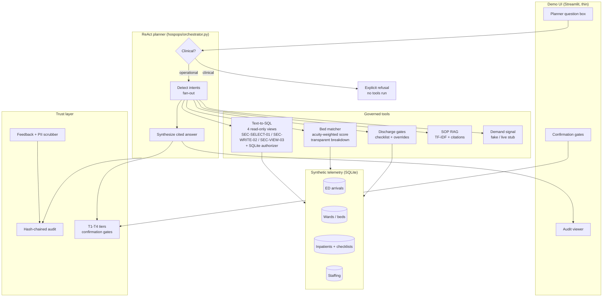
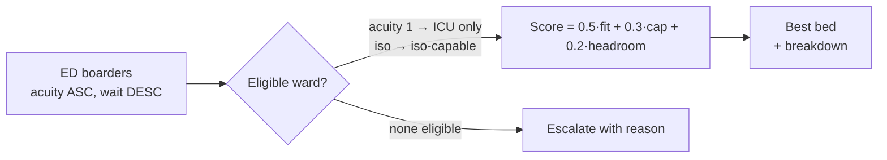
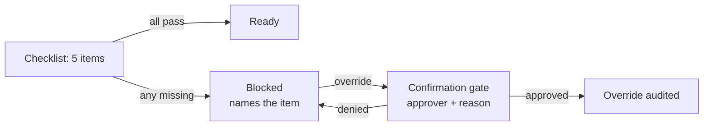
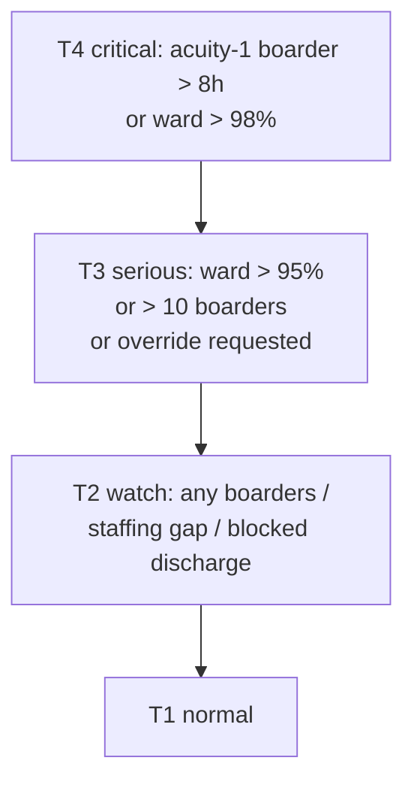

# Architecture

## System overview

```mermaid
flowchart TB
    subgraph UI["Demo UI (Streamlit, thin)"]
        Q[Planner question box]
        G[Confirmation gates]
        A[Audit viewer]
    end

    subgraph Planner["ReAct planner (hospops/orchestrator.py)"]
        CLIN{Clinical?}
        INT[Detect intents<br/>fan-out]
        SYN[Synthesize cited answer]
    end

    subgraph Tools["Governed tools"]
        SQL[Text-to-SQL<br/>4 read-only views<br/>SEC-SELECT-01 / SEC-WRITE-02 / SEC-VIEW-03<br/>+ SQLite authorizer]
        BM[Bed matcher<br/>acuity-weighted score<br/>transparent breakdown]
        DC[Discharge gates<br/>checklist + overrides]
        RAG[SOP RAG<br/>TF-IDF + citations]
        DEM[Demand signal<br/>fake / live stub]
    end

    subgraph Data["Synthetic telemetry (SQLite)"]
        ED[(ED arrivals)]
        WARD[(Wards / beds)]
        IP[(Inpatients + checklists)]
        STF[(Staffing)]
    end

    subgraph Trust["Trust layer"]
        AUD[Hash-chained audit]
        FB[Feedback + PII scrubber]
        ESC[T1-T4 tiers<br/>confirmation gates]
    end

    Q --> CLIN
    CLIN -- clinical --> REFUSE[Explicit refusal<br/>no tools run]
    CLIN -- operational --> INT
    INT --> SQL & BM & DC & RAG & DEM
    SQL --> Data
    BM --> Data
    DC --> Data
    SYN --> ESC
    INT --> SYN
    SYN --> A
    Planner --> AUD
    FB --> AUD
    G --> ESC
```

## Bed-matching flow

```mermaid
flowchart LR
    B[ED boarders<br/>acuity ASC, wait DESC] --> F{Eligible ward?}
    F -- acuity 1 → ICU only<br/>iso → iso-capable --> S[Score = 0.5·fit + 0.3·cap + 0.2·headroom]
    S --> T[Best bed<br/>+ breakdown]
    F -- none eligible --> E[Escalate with reason]
```

## Discharge-gate flow

```mermaid
flowchart LR
    C[Checklist: 5 items] -- all pass --> R[Ready]
    C -- any missing --> BL[Blocked<br/>names the item]
    BL -- override --> GT[Confirmation gate<br/>approver + reason]
    GT -- approved --> O[Override audited]
    GT -- denied --> BL
```

## Escalation tiers

```mermaid
flowchart TB
    T4["T4 critical: acuity-1 boarder > 8h<br/>or ward > 98%"]
    T3["T3 serious: ward > 95%<br/>or > 10 boarders<br/>or override requested"]
    T2["T2 watch: any boarders /<br/>staffing gap / blocked discharge"]
    T1["T1 normal"]
    T4 --> T3 --> T2 --> T1
```
